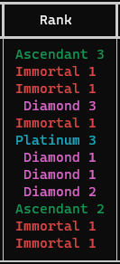
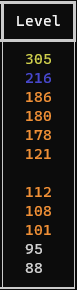

    
<h5 align="center"> VALORANT Eirlys Checker</h5>

https://valorant.bestiestudio.com/
    
 
  <ol>
    <li><a href="#about-the-project">About The Project</a></li>
    <li><a href="#usage">Usage</a></li>
    <li><a href="#contributing">Contributing</a></li>
    <li><a href="#contact">Contact</a></li>
    <li><a href="#acknowledgements">Acknowledgements</a></li>
    <li><a href="#disclaimer">Disclaimer</a></li>
  </ol>

    
## About The Project

 
 

|Their Queue|Current Skin|Current Rank|Rank Rating|Peak Rank|Account Level|
|:---:|:---:|:---:|:---:|:---:|:---:|
|||||||
    
